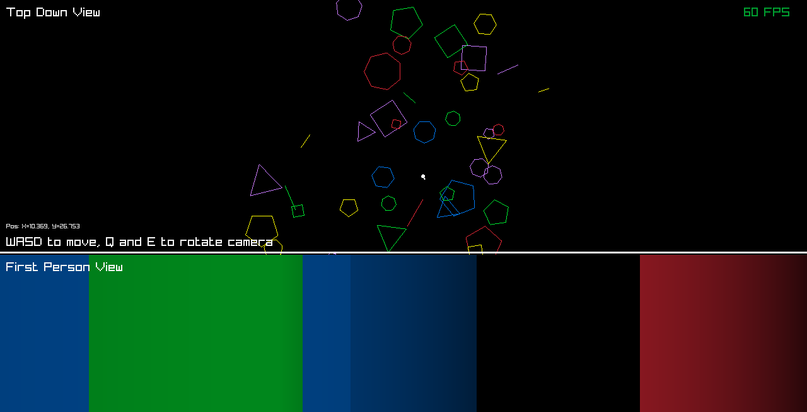

# Flatland
2D world, 1D view raytracing thing, inspired on the Flatland book.



## Running
Run the project directly with:
``` sh
go run github.com/ManuelGarciaF/flatland@latest
```

Or, clone the repository manually and run it:
``` sh
git clone https://github.com/ManuelGarciaF/flatland.git
go run main.go
```
